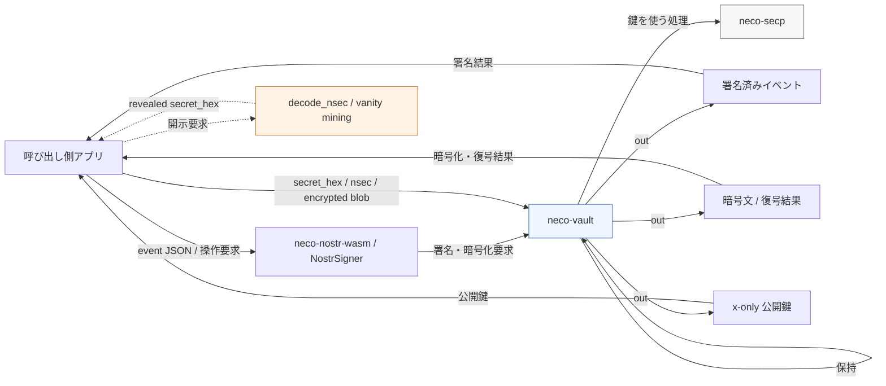

# neco-vault -- アーキテクチャノート

この文書では `neco-vault` の数理ではなく、鍵使用境界の構成を扱う。API 一覧と feature の説明は [README-ja.md](README-ja.md) を参照。

## 位置づけ

`neco-vault` は秘密鍵の永続保管を担う crate ではなく、秘密鍵を要する処理を 1 つの境界へ集約するための crate である。主眼は、呼び出し側が `SecretKey` を直接持ち回る構成を避け、署名、暗号化、公開鍵導出の実行点を局所化することにある。

`neco-secp` だけでも署名機能は構成できるが、その場合は鍵の保持、鍵の選択、鍵を使う処理が呼び出し側へ分散しやすい。`neco-vault` はこれらを同一層へまとめ、外側には処理結果だけを返す。

## 層構成

責務の分割は次のとおりである。

- `neco-secp`: 暗号コア
- `neco-vault`: 鍵使用境界
- `neco-nostr-wasm`: JavaScript 境界

暗号実装、鍵使用ポリシー、FFI 境界を分離することで、変更点と責務を局所化している。

## 責務

`neco-vault` の責務は次の 3 点に整理できる。

1. 平文秘密鍵を内部エントリとして保持する
2. label と active account によって鍵選択を管理する
3. 署名、NIP-04、NIP-44 など秘密鍵を要する処理を内部で完結させる

このため public API は原則として `SecretKey` を返さない。外側へ出る値は、署名済みイベント、暗号化済みペイロードまたは復号結果、導出済み公開鍵である。

## 経路の分類

この周辺 crate では、秘密鍵に関わる経路を 3 種類に分けて考える。

1. 入口
2. 通常運用経路
3. 明示的開示経路

入口には `import_plaintext` のように平文秘密鍵を受け取る操作がある。通常運用経路では vault が鍵を保持し、署名、暗号化、公開鍵導出の結果だけを返す。明示的開示経路では、相互運用やユーザー確認のために平文秘密鍵を扱う utility を別経路として持つ。

したがって、`neco-vault` の原則は通常運用経路に関するものであり、入口や明示的開示経路まで含めて一律に「平文秘密鍵を返さない」と述べているわけではない。

## 保証範囲

`neco-vault` が提供するのは、通常運用経路で平文秘密鍵を持ち回らせないという境界である。呼び出し側は label または active account を通して鍵を選択し、秘密鍵そのものではなく処理結果を受け取る。

`security-hardening` feature が提供する定数時間タッチ、擬似遅延、ダミー演算は、この境界の内側にある秘密鍵利用経路へ追加フックを与えるものである。これは新しい暗号学的保証を導入するものではなく、鍵を使う箇所を局所化したうえで、局所的な hardening を可能にする補助機構である。

## 非対象

`neco-vault` が扱う対象は限定される。

- プロセス内メモリでの保持
- 鍵使用境界の局所化
- import/export 形式の制御

一方で、HSM、OS キーチェーン、永続保管付きシークレットマネージャ、side-channel に対する完全防御はこの crate の責務ではない。`encrypted` feature も vault 自体を永続ストアへ拡張するものではなく、境界を越える際の import/export 形式を制御する補助である。

## import/export

`import_plaintext` は平文秘密鍵を受け取る。これは設計上の例外ではなく、鍵使用境界の入口として必要な操作である。鍵を受け取る入口は必要だが、その後の通常 API で平文秘密鍵を返り値として広げないことが、この crate の方針である。

`export_encrypted` と `import_encrypted` は、境界を越える際の表現を平文より制御しやすい形へ寄せるための機能である。ここでの関心は保管システム全体の構築ではなく、境界を越える値の形式を明示することにある。

## wasm 境界

隣接 crate の `neco-nostr-wasm` は JavaScript 相互運用のため、`neco-vault` とは異なる境界条件を持つ。通常の署名・暗号化経路は vault を経由するが、一部の補助 API には明示的開示経路がある。

代表例は `decode_nsec` とバニティ採掘補助である。これらは vault の通常運用経路に平文秘密鍵の返却を混在させるものではなく、FFI 境界で必要になる utility を別経路として切り出したものである。用途としては、他実装との相互運用、既存キーの確認、ユーザー自身による秘密鍵表示が該当する。

整理すると、通常運用経路では `neco-vault` が平文秘密鍵を返さず、相互運用や確認のための明示的開示経路だけが `neco-nostr-wasm` 側に存在する。重要なのは、この経路が vault 本体の API に混在していないことである。

## 採用理由

この構成の主眼は、秘密鍵の価値を過度に強調することではなく、用途が明確な鍵について、暗号コア、鍵使用境界、FFI 境界を分離し、変更点を閉じ込めやすくすることにある。

この分離により、暗号実装、ブラウザー境界、鍵使用ポリシーのいずれを変更する場合でも、影響範囲を比較的限定しやすい。

## まとめ

`neco-vault` は保管強度を前面に出す crate ではなく、秘密鍵を使うコードを局所化するための境界 crate である。焦点は、どこで鍵を受け取り、どこで鍵を使い、どこでは結果だけを返すのか、という責務分離にある。
